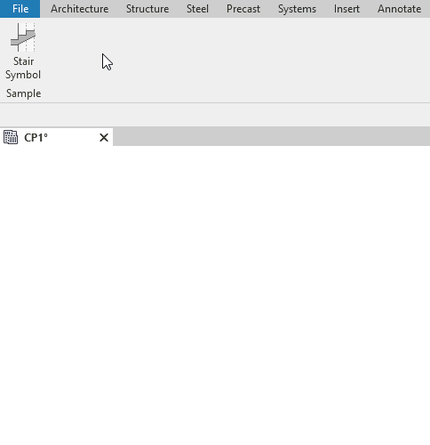

# SCADtools.Revit.UI.RibbonItemToolTip
Represents a standard tooltip that will be displayed in a RibbonItem.

## RibbonItemToolTip in Revit
**Below is the integration of a custom tooltip that incorporates an animated image in GIF format.**



### Constructors
| Name | Description |
|:-|:-|
| RibbonItemToolTip | Initializes a new instance of the RibbonItemToolTip class. |

### Properties
| Name | Description |
|:-|:-|
| Title | Gets or sets the description title that appears as a ToolTip for the item. |
| Content | Gets or sets the content string displayed in the tooltip. |
| ExpandedContent | Gets or sets the second-level content for the tooltip. |
| ExpandedImage | Gets or sets the image to be displayed below the second-level content. |

## :floppy_disk: Download
You can reference the DLL in a Visual Studio project the same way you load any external library.
| Version                      | DLL File                                                                                |
|:-----------------------------|:----------------------------------------------------------------------------------------|
| Revit 202x                   | [RibbonItemToolTip for Revit 202x](https://github.com/SpeedCAD/SCADtools.Revit.UI.RibbonItemToolTip/releases/download/v1.0.0/SCADtools.Revit.UI.RibbonItemToolTip_1.0.0.zip) |

## :rocket: Making
- The DLL files are made using [**Visual Studio**](https://github.com/microsoft) 2022.

## :keyboard: Code example
```c#
using Autodesk.Revit.UI;
using Autodesk.Windows;
using SCADtools.Revit.UI;
using System;
using System.Linq;
using System.Reflection;
using System.Windows.Media.Imaging;

namespace SCADtools.RibbonItemToolTipSample
{
    public class ExternalApplication : IExternalApplication
    {
        private static readonly string assemblyName = Assembly.GetExecutingAssembly().Location;
        private static readonly string tabName = "SCADtools";
        private static readonly string panelName = "Sample";

        public Result OnStartup(UIControlledApplication application)
        {
            CreateRibbonTab(application);

            return Result.Succeeded;
        }
        public Result OnShutdown(UIControlledApplication application)
        {
            return Result.Succeeded;
        }

        private static void CreateRibbonTab(UIControlledApplication application)
        {
            application.CreateRibbonTab(tabName);

            Autodesk.Revit.UI.RibbonPanel ribbonPanel = application.CreateRibbonPanel(tabName, panelName);

            PushButtonData pushButtonData = CreatePushButtonData();
            ribbonPanel.AddItem(pushButtonData);

            RibbonTab ribbonTab = ComponentManager.Ribbon.Tabs.First(x => x.Title == tabName);
            RibbonPanelSource ribbonPanelSource = ribbonTab.Panels.Select(x => x.Source).Single(x => x.AutomationName == ribbonPanel.Name);
            Autodesk.Windows.RibbonButton ribbonButton = (Autodesk.Windows.RibbonButton)ribbonPanelSource.
                FindItem("CustomCtrl_%CustomCtrl_%" + tabName + "%" +
                ribbonPanelSource.Name + "%" +
                pushButtonData.Name);

            ribbonButton.ToolTip = new RibbonItemToolTip()
            {
                Title = "Stair Symbol",
                Content = "Insert stair symbology.",
                ExpandedContent = "Allows assigning a stair symbol to represent the starting and ending runs.",
                ExpandedImage = new BitmapImage(new Uri("pack://application:,,,/RibbonItemToolTipSample;component/Images/StairSymbolTooltip.gif"))
            };
        }

        private static PushButtonData CreatePushButtonData()
        {
            string className = "SCADtools.RibbonItemToolTipSample.Sample";
            Uri uriImage = new Uri("pack://application:,,,/RibbonItemToolTipSample;component/Images/struturalplan_symbol_stair_32_light.png");
            PushButtonData pushButtonData = new PushButtonData("PushButtonDataSample", "Sample", assemblyName, className)
            {
                LargeImage = new BitmapImage(uriImage),
                Text = "Stair" + "\r\n" + "Symbol"
            };

            return pushButtonData;
        }
    }
}
```
